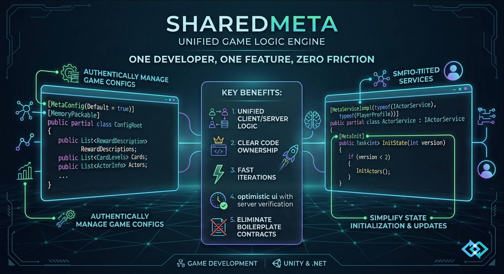

<p align="center">
  
</p>

<p align="center">
  <strong>Unified Game Logic Engine — write once, run on client and server with deterministic replay</strong>
</p>

<p align="center">
  <a href="https://github.com/CoreGameIO/SharedMeta/releases"></a>
  <a href="https://github.com/CoreGameIO/SharedMeta/blob/main/LICENSE"></a>
  <a href="https://unity.com"></a>
  <a href="https://dotnet.microsoft.com"></a>
  <a href="https://learn.microsoft.com/dotnet/orleans/"></a>
</p>

<p align="center">
  <a href="#quick-start-unity">Quick Start</a> &bull;
  <a href="#what-you-can-build">Features</a> &bull;
  <a href="#architecture">Architecture</a> &bull;
  <a href="#key-concepts">Key Concepts</a> &bull;
  <a href="#examples">Examples</a> &bull;
  <a href="docs/GUIDE.md">Documentation</a>
</p>

---

Write game logic **once** in C# — it runs on the server (Orleans grains) and replays on the client (Unity / .NET) with optimistic execution, automatic rollback, and desync detection.

## What You Can Build

**Player profiles and progression** — experience, levels, inventory, currencies. State is persisted per-player, changes are optimistic (instant on client, validated on server).

**Turn-based and card games** — shared game rules execute identically on both sides. Matchmaking, lobbies, multi-entity game sessions with deterministic random for shuffles and draws.

**Cooperative and async multiplayer** — one player's action modifies another player's state via cross-entity calls. Energy systems, trading, expeditions that span multiple entities.

**Economy and resource systems** — crafting, shops, timers, regeneration. Server-only random for loot drops and rewards (client can't predict or cheat). ServerPatch mode for bandwidth-efficient state diffs.

**Reactive UI with change tracking** — mark state fields with `[Tracked]`, subscribe to typed change notifications. Push-based — no polling or snapshot diffs. Client-only, zero server overhead.

**Live-ops and admin tools** — server-side triggers push events to clients. Subscribers react to state changes. Hot-swappable transport (WebSocket or HTTP polling) and serializer (MemoryPack or MessagePack).

**Query and inspection** — check any entity's status without subscribing. Get brief info about other players, check if a game session is active, preview inventory — all via lightweight read-only calls with optional open access.

## Quick Start (Unity)

### 1. Install the Package

Add to `Packages/manifest.json`:
```json
{
  "dependencies": {
    "com.coregame.sharedmeta": "https://github.com/CoreGameIO/SharedMeta.git#upm"
  }
}
```

### 2. Open the Project Wizard

**Tools > SharedMeta > Project Wizard** in Unity menu.

Configure:
- **Project name** — your shared namespace (default `Meta.Shared`, e.g. `MyGame.Shared`)
- **State name** — entity state class (e.g. `PlayerProfile`)
- **Transport** — SignalR (WebSocket, real-time) or HTTP Polling (universal, no extra DLLs)
- **Serializer** — MemoryPack (default) or MessagePack

The **Dependencies** section auto-detects and installs required packages (serializer, transport).

### 3. Generate Projects

Use the three generation tabs:

| Tab | Generates | Output |
|-----|-----------|--------|
| **Shared Project** | State class, service interface, implementation, .csproj | Unity folder + .NET mirror with linked sources |
| **Server Project** | ASP.NET Core server with Orleans, transport, auth | Standalone .NET project |
| **Client Scripts** | `MetaGameClient.cs` MonoBehaviour + logger | Unity Assets folder |

### 4. Run

Start the server from Unity: **Tools > SharedMeta > Server Runner** — click **Start**.

Or from terminal:
```bash
cd Meta.Server
dotnet run
```

Press Play in Unity — `MetaGameClient` connects automatically.

### Quick Start (.NET Client — Godot, Console, etc.)

Add NuGet packages to your `.csproj`:
```xml
<ItemGroup>
  <PackageReference Include="CoreGame.SharedMeta.Core" Version="0.12.3" />
  <PackageReference Include="CoreGame.SharedMeta.Client" Version="0.12.3" />
  <PackageReference Include="CoreGame.SharedMeta.Serialization.MemoryPack" Version="0.12.3" />
  <PackageReference Include="CoreGame.SharedMeta.Transport.SignalR.Client" Version="0.12.3" />
  <PackageReference Include="CoreGame.SharedMeta.Generator" Version="0.12.3"
                    PrivateAssets="all" OutputItemType="analyzer" />
</ItemGroup>
```

Client transport packages have no server dependencies (no Orleans, no ASP.NET). Works with Godot (`Godot.NET.Sdk`), console apps, or any `net8.0+` project.

For MessagePack SignalR protocol (optional, better performance):
```xml
<PackageReference Include="CoreGame.SharedMeta.Transport.SignalR.MessagePack" Version="0.12.3" />
```

### Quick Start (examples)

```bash
dotnet run --project examples/CardGame_TheFool/CardGame.Server
dotnet run --project examples/CardGame_TheFool/CardGame.Client
```

## Architecture

```
┌─────────────────────────────────────────────────────────────────┐
│  Meta Layer (SharedMeta.Core, YourGame.Shared)                  │
│  Business logic: services, state, [MetaService] / [MetaMethod]  │
│  Code generation: dispatchers, API clients, context injection   │
└─────────────────────────────────────────────────────────────────┘
                              ↕
┌──────────────────────────────────────────────────────────────────────────────┐
│  Middleware Layer (SharedMeta.Client, SharedMeta.Server)                     │
│  MetaContext, replay mechanism, execution modes                              │
│  Optimistic / Server / Local / CrossOptimistic / ServerPatch / ServerReplace │
└──────────────────────────────────────────────────────────────────────────────┘
                              ↕
┌─────────────────────────────────────────────────────────────────┐
│  Serialization Layer (SharedMeta.Serialization.*)               │
│  IMetaSerializer, MemoryPack / MessagePack implementations      │
└─────────────────────────────────────────────────────────────────┘
                              ↕
┌─────────────────────────────────────────────────────────────────┐
│  Transport Layer (SharedMeta.Transport.*)                       │
│  IConnection: SignalR WebSocket, HTTP long-polling, InProcess   │
└─────────────────────────────────────────────────────────────────┘
                              ↕
┌─────────────────────────────────────────────────────────────────┐
│  Server Backend (SharedMeta.Server.Core, Orleans)               │
│  IMetaProvider<TState>, EntityGrain, SessionManager             │
└─────────────────────────────────────────────────────────────────┘
```

Each layer depends only on the layers above it. Swap serializers, transports, or backends without changing game logic.

## Key Concepts

### Define Shared State

```csharp
[MemoryPackable(GenerateType.VersionTolerant), MessagePackObject]  // pick one or both
public partial class GameState : ISharedState
{
    [Key(0), MemoryPackOrder(0)] public int Score { get; set; }
    [Key(1), MemoryPackOrder(1)] public List<string> Items { get; set; } = new();
}
```

- `[MemoryPackable(GenerateType.VersionTolerant)]` + `[MemoryPackOrder(n)]` — MemoryPack (default, zero-copy, safe field evolution)
- `[MessagePackObject]` + `[Key(n)]` — MessagePack (cross-platform, schema-flexible)

Choose one serializer or use both. Orleans `[GenerateSerializer]`/`[Id(n)]` are **not needed** on game state — they're only used internally by the framework. The wizard configures this automatically.

### Define a Service

```csharp
[MetaService("IGameService")]
public interface IGameService
{
    [MetaMethod(ExecutionMode.Optimistic)]
    void AddItem(string itemId);

    [MetaMethod(ExecutionMode.Server)]
    void GrantReward(int amount);
}
```

### Implement the Service

```csharp
[MetaServiceImpl(typeof(IGameService))]
public partial class GameServiceImpl : IGameService
{
    // Context is injected by source generator
    public void AddItem(string itemId)
    {
        State.Items.Add(itemId);
    }

    public void GrantReward(int amount)
    {
        // ServerRandom only generates on server; client replays from payload
        int bonus = Context.ServerRandom!.Next(10);
        State.Score += amount + bonus;
    }
}
```

### Execution Modes

| Mode | Client | Server | Use Case |
|------|--------|--------|----------|
| **Optimistic** | Executes immediately, rolls back on mismatch | Authoritative execution | UI-responsive actions (move, play card) |
| **Server** | Waits for server response | Executes with ServerRandom | Loot drops, matchmaking, secrets |
| **Local** | Local-only, no RPC | — | UI state, client-side filtering |
| **CrossOptimistic** | Executes on own state | Routes to target entity's grain | Cross-entity interactions |
| **ServerPatch** | Receives state diff from server | Sends patch instead of full state | Large state, bandwidth optimization |
| **ServerReplace** | Receives full state from server | Executes and sends complete state | Map generation, full reset, bulk state changes |

### Deterministic Random

```csharp
// Optimistic random — same algorithm & seed on both sides
int roll = Context.Random!.Next(6) + 1;

// Server random — generated on server, replayed on client
int loot = Context.ServerRandom!.Next(100);
```

### Query Calls

Read-only calls to any entity without subscribing — useful for checking status, fetching brief info in multiplayer.

```csharp
[MetaService(StateType = typeof(GameState))]
public interface IGameService : IMetaService
{
    [MetaMethod(Mode = ExecutionMode.Query)]              // queryable, respects access policy
    bool IsActive();

    [MetaMethod(Mode = ExecutionMode.Query, OpenAccess = true)]  // queryable, anyone can call
    string GetPublicInfo();
}
```

Client usage:
```csharp
// No subscription — one-off network call
var queryApi = new GameServiceQueryApi(connection, serializer);
var info = await queryApi.EntityApi("entity-123").GetPublicInfoAsync();

// Already subscribed — executes locally, no network call
var gameApi = client.GetService<GameServiceApiClient>();
bool active = gameApi.IsActive();  // synchronous, reads local state
```

### Cross-Entity State Access

Read another entity's state from shared code — no explicit dependency injection needed:

```csharp
var otherState = Context.GetState<PlayerProfile>("other-player-id");
if (otherState != null)
    // use otherState.Level, otherState.Name, etc.
```

Recorded to replay payload for deterministic client replay.

### Client Usage

```csharp
var client = new MetaClient(connection, serializer);
await client.ConnectAsync("player-123", "entity-456");

// Generated typed API client
var gameApi = client.GetService<IGameServiceApiClient>();
gameApi.AddItem("sword_01");

// Subscribe to state changes
client.OnStateChanged += state => UpdateUI((GameState)state);
```

## Running the Server

### From Unity (recommended)

Open **Tools > SharedMeta > Server Runner** in the Unity menu. This opens an Editor window where you can:

- **Select your server .csproj** — auto-detected from Wizard settings, or pick manually
- **Start / Stop** the server with one click
- **View console output** with search, filtering, and color-coded log levels (errors in red, warnings in yellow)
- **Open in IDE** or **Reveal** in file explorer
- **Pass extra arguments** via the "Extra Args" field (e.g. `-- 5001` for a different port)

The server process survives Unity domain reloads (script compilation) and is automatically stopped when the Editor quits. The Runner tracks the process PID across reloads so it can re-attach to a running server.

### From Terminal

```bash
cd YourGame.Server
dotnet run
```

By default the server listens on `http://localhost:5000`. Pass a port as argument: `dotnet run -- 5001`.

### Multiple Clients

To test multiplayer locally (e.g. matchmaking), you need two Unity clients connecting to the same server:

- **Editor + Build**: Press Play in the editor, then Build & Run a standalone player
- **Two builds**: build twice and run both executables
- **ParrelSync**: clone the project for a second editor instance

All clients connect to the same server URL. The server handles session management and entity routing via Orleans grains.

## Examples

### CardGame "The Fool"

Multiplayer turn-based card game with matchmaking lobby. Two players, attack/defend mechanics, trump suit. Demonstrates: `Optimistic` execution for card plays, `Server` mode for deck shuffle, lobby system with triggers, multi-entity game state.

### Expedition

Single-player dungeon exploration with procedural map generation. Two entities (Profile + Expedition) connected via cross-entity calls for energy/money economy. Demonstrates: `CrossOptimistic` for responsive movement, cross-entity `SpendEnergy`/`AddMoney` calls, `[MetaInit]` for procedural map generation with `Context.Random`, `[Tracked]` fields for push-based UI updates, `[MetaConfig]` for game balance, **Query Calls** to check expedition status without subscribing, **generation mode choice** (ServerReplace vs Optimistic) showing the difference between server-authoritative and client-predicted state. Full Unity client with runtime-generated UI.

## Project Structure

| Directory | Description |
|-----------|-------------|
| `Runtime/Core/` | Core framework: attributes, interfaces, meta context, random |
| `Runtime/Client/` | Client-side dispatcher, message buffer, MetaClient |
| `Runtime/Transport/` | Conditional transport assemblies: HTTP Polling, SignalR client |
| `Runtime/Serialization/` | MemoryPack serialization |
| `Runtime/Orleans.Stubs/` | Stub attributes for Unity (no Orleans dependency) |
| `Editor/` | Project Wizard, Server Runner, pre-built source generator DLL |
| `src/SharedMeta.Generator/` | Source generator: dispatchers, API clients, context injection |
| `src/SharedMeta.Server/` | Server-side meta context and cross-entity calls |
| `src/SharedMeta.Server.Core/` | EntityGrain, MetaProvider, file storage, session management |
| `src/SharedMeta.Orleans/` | Orleans grain integration |
| `src/SharedMeta.Transport.SignalR/` | SignalR transport — server (MetaHub) + MessagePack protocol |
| `src/SharedMeta.Transport.SignalR.Client/` | SignalR client-only (JSON default, no server deps) |
| `src/SharedMeta.Transport.SignalR.MessagePack/` | MessagePack protocol extension for SignalR |
| `src/SharedMeta.Transport.HttpPolling/` | HTTP polling transport — server endpoints |
| `src/SharedMeta.Transport.HttpPolling.Client/` | HTTP polling client-only (HttpClient, no server deps) |
| `src/SharedMeta.Auth/` | JWT authentication middleware |
| `examples/` | CardGame_TheFool, Expedition — full working examples |
| `tests/` | Integration and unit tests |

## License

[MIT](LICENSE)
